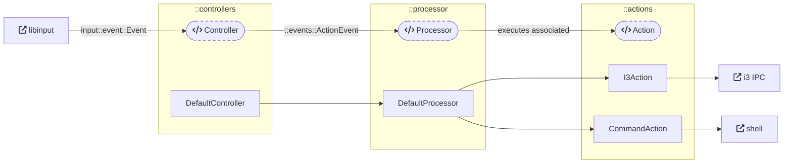
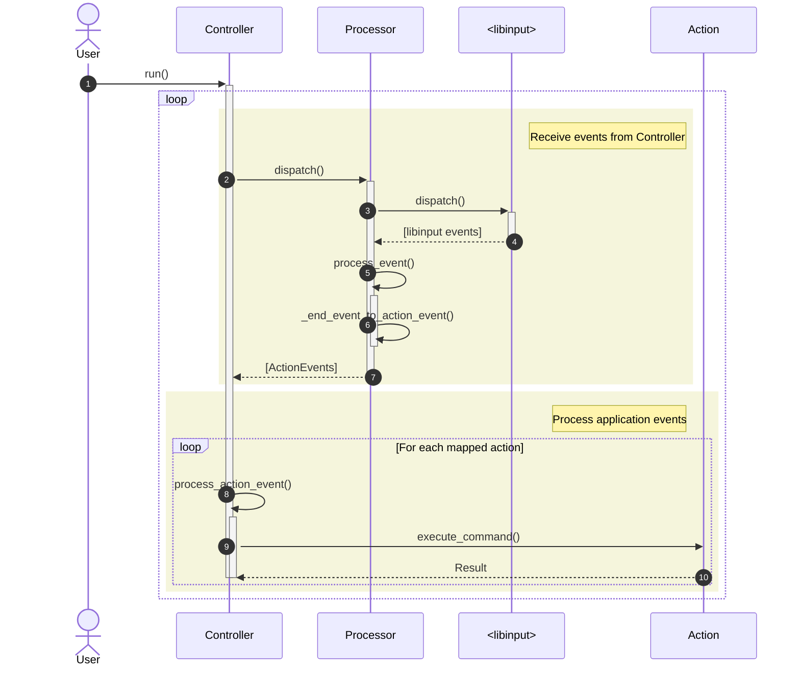

# `lillinput`

[![crates.io]](https://crates.io/crates/lillinput)

The `lillinput` library provides the building blocks for connecting
`libinput` events with different actions.

## Building blocks

### Traits and implementations

The following traits are the main building blocks of the library:

| Trait                     | Description                                                                                                   | Implementations                               |
|---------------------------|---------------------------------------------------------------------------------------------------------------|-----------------------------------------------|
| `action::Action`          | Handler for a specific action, that is triggered by an application event                                      | `actions::I3Action`, `actions::CommandAction` |
| `events::Processor`       | Responsible for interacting with `libinput` and dispatching its events, converting them to application events | `events::DefaultProcessor`                    |
| `controllers::Controller` | Contains the logic for connecting application events to `Action`s, and orchestrating                          | `controllers::DefaultController`              |

The library also includes basic `Implementations` of the main traits, in a
"batteries included" approach.

### Enums

The following enums represent different concepts of the library:

| Enum                  | Description                                                                                                                  |
|-----------------------|------------------------------------------------------------------------------------------------------------------------------|
| `events::ActionEvent` | Higher-level application event, emitted by the `Processor` and used by the `Controller` for mapping to one or more `Action`s |
| `actions::ActionType` | Identifier for a specific family of actions                                                                                  |

### Overview

The following diagram represents the flow and relationships between the components:

## Other notes

### Error handling

The errors emitted by the components are available in an `errors` module under
each of the main modules, with the individual [`thiserror`]-based error `Enums`
re-exported for convenience.

### Controller execution

The `Controller` provides a `run()` method which enters a loop for receiving
events from the `Processor` and invoking `Action`s depending on the events
received:

## License

This project is licensed under [BSD-3-Clause].

[BSD-3-Clause]: ../../LICENSE

[`i3ipc`]: https://github.com/tmerr/i3ipc-rs
[`input`]: https://github.com/Smithay/input.rs
[`thiserror`]: https://github.com/dtolnay/thiserror

[crates.io]: https://img.shields.io/crates/v/lillinput
