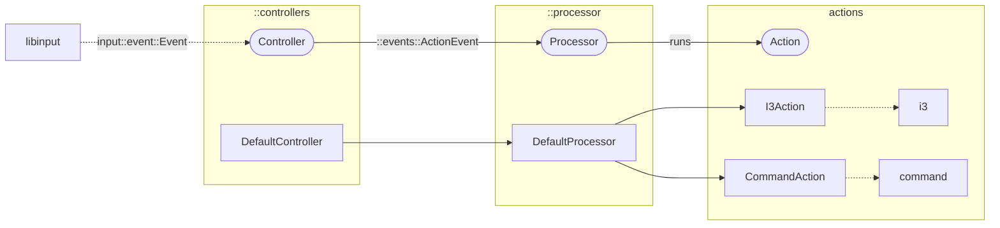

# lillinput

[![crates.io]](https://crates.io/crates/lillinput)

## Overview

The `lillinput` library provides the building blocks for connecting
`libinput` events with different actions:

## License

This project is licensed under [BSD-3-Clause].

[BSD-3-Clause]: ../../LICENSE

[`i3ipc`]: https://github.com/tmerr/i3ipc-rs
[`input`]: https://github.com/Smithay/input.rs

[crates.io]: https://img.shields.io/crates/v/lillinput
